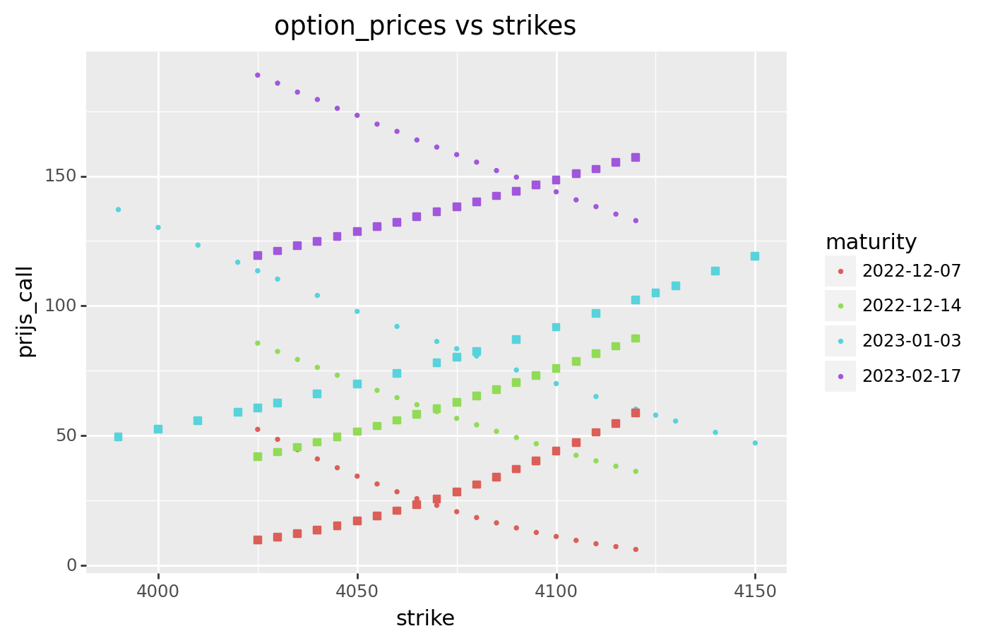
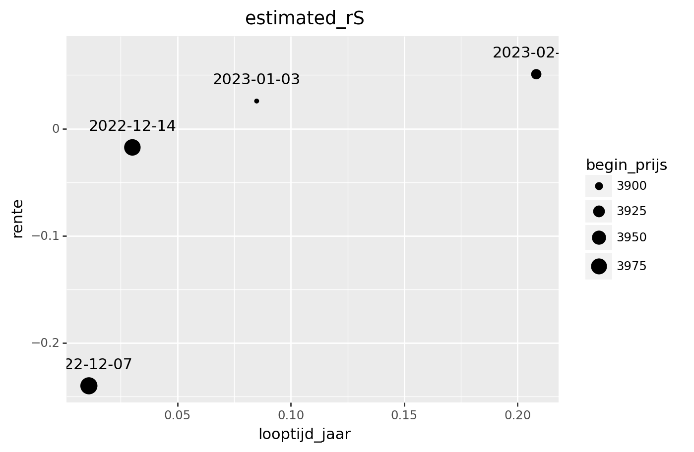
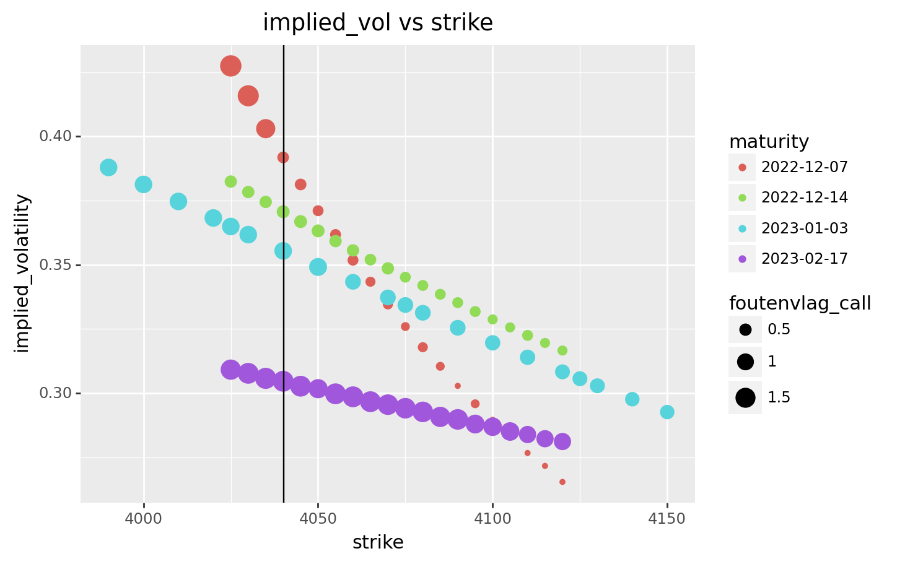

# Calibratie-van-de-Black-Scholes-parameter (course project)

## requirements
Python3, matplotlib, numpy, pandas, plotnine

## getting data
I chose the S&P 500 index on 
https://www.barchart.com/stocks/quotes/$SPX/options
(which has a daily limit on downloads)
I put the data in (../data/).

## estimate interest rates and begin prices

### data cleaning
I cleaned the data and put everything in (../data/options_spx_data.csv). 
I visualised this in plots:

### estimating r and S_0
I used simple algebra and put the results in (../data/options_spx_estimated_rS.csv). 

### compare to FED and LIBOR
I couldn't find fast what the FED and the LIBOR were for those maturities but
the ones I found were all around 3.5% - 4.2 %.

## implicit volatility
I got a program from the internet that
calculates implicit  volatility (a la Black-Scholes).
Result:

If the underlying followed Black-Scholes.
## estimate realized volatily of time series
There are many ways to estimate the volatility
of time series (GARCH for example). I assumed constant volatility and went
with the first formula I found on the internet. Results:

