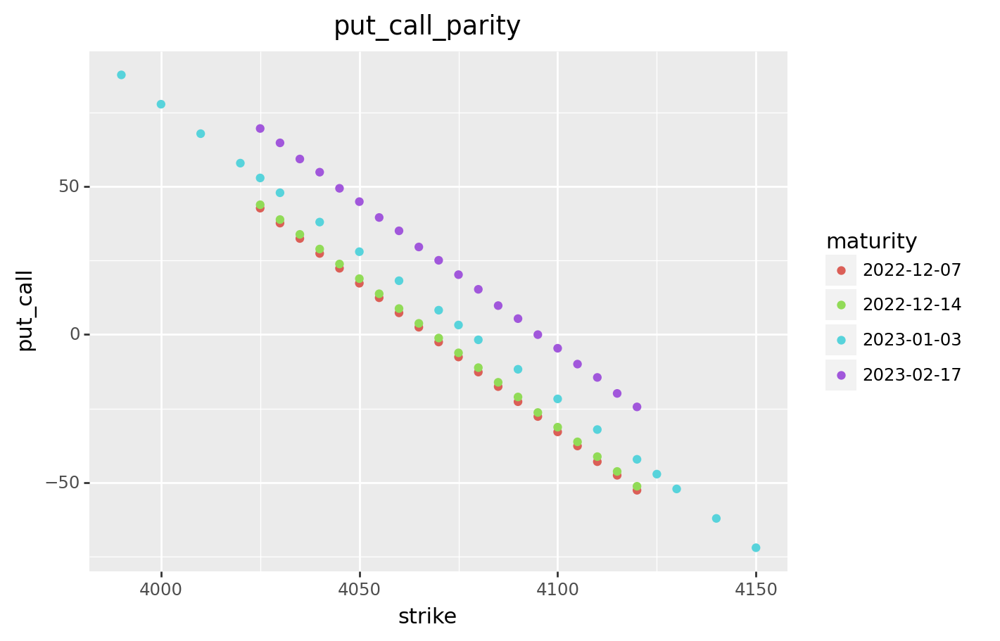

# Calibratie-van-de-Black-Scholes-parameter (course project)

## requirements
Python3, matplotlib, numpy, pandas, plotnine

##  1. getting data
I chose the S&P 500 index on 
https://www.barchart.com/stocks/quotes/$SPX/options
(which has a daily limit on downloads)
I put the data in (../data/).

## 2. estimate interest rates and begin prices

### data cleaning
I cleaned the data and put everything in (../data/options_spx_data.csv). 
I visualised this in plots:

### estimating r and S_0
I used simple algebra and put the results in (../data/options_spx_estimated_rS.csv). 

### compare to FED and LIBOR
I couldn't find fast what the FED and the LIBOR were for those maturities but
the ones I found were all around 3.5% - 4.2 %.

## 3. implicit volatility
I got a program from the internet that
calculates implicit  volatility (a la Black-Scholes) for call options.
Result:

In a 100% Black-Scholes world the implicit volatility 
shouldn't vary with the strike.
If only the underlying followed Black-Scholes. 
You get artefacts of approximate delta hedging and transaction cost/delay. 
These are worse close to maturity and around the money options
because gamma goes to infinity and then the price depends on the 
price of risk.

The bid ask spread is smallest for the earliest maturity with highest 
strike (see plot). I'm not sure why but if I had to guess that is where
the price of the option is the certainest 
(jumps of 5% up in 2 days are unlikely).

## 4. estimate realized volatily of time series
There are many ways to estimate the volatility
of time series (GARCH model for example). I assumed constant volatility and went
with the first formula I found on the internet.(the results aren't accurate because
I didn't use alot of data even under constant assumption).

Data:

Results:

